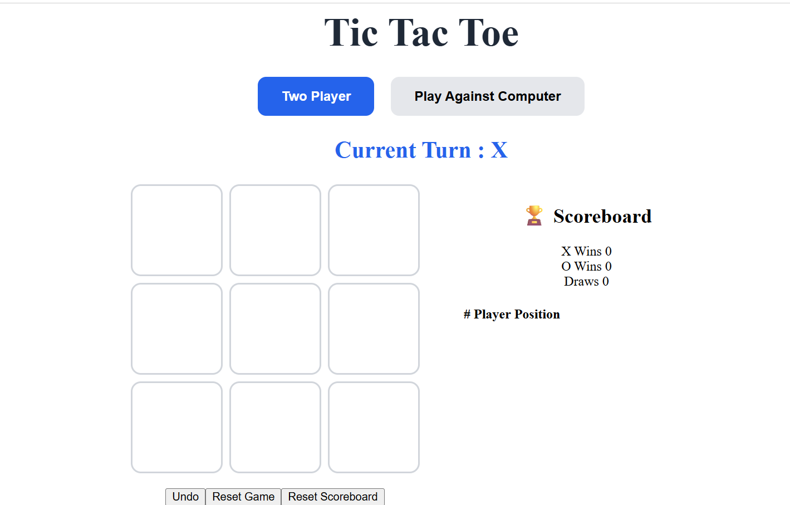
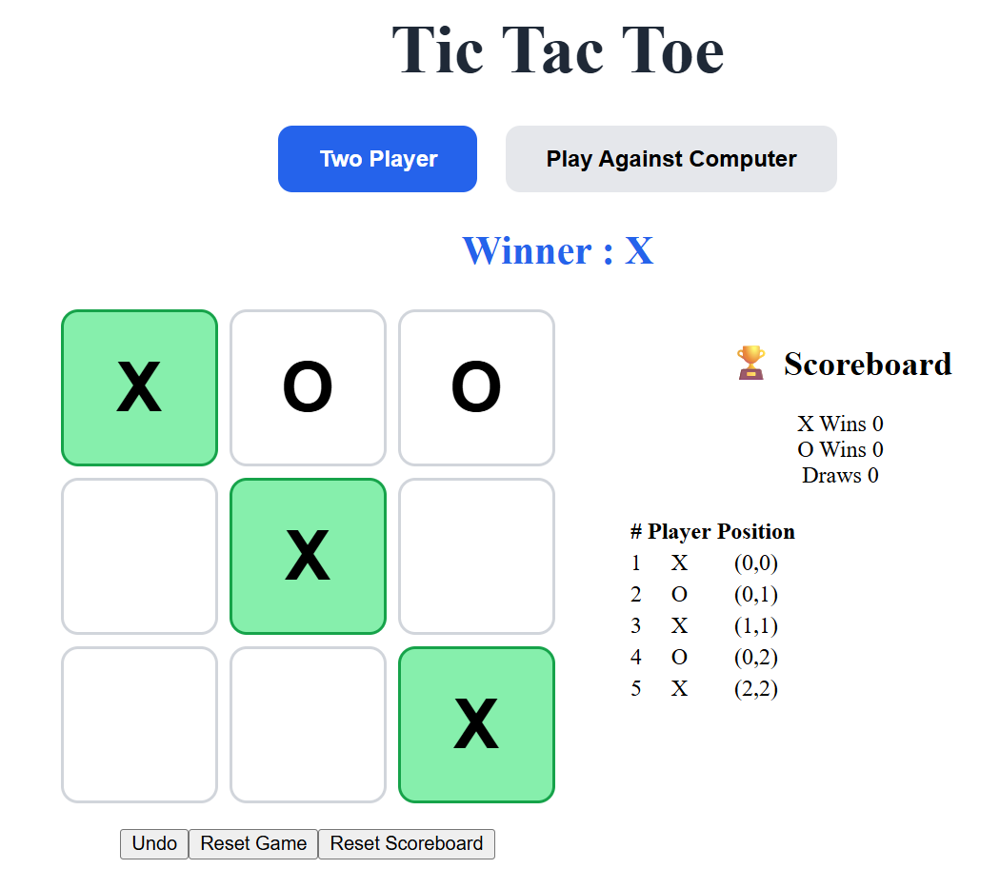
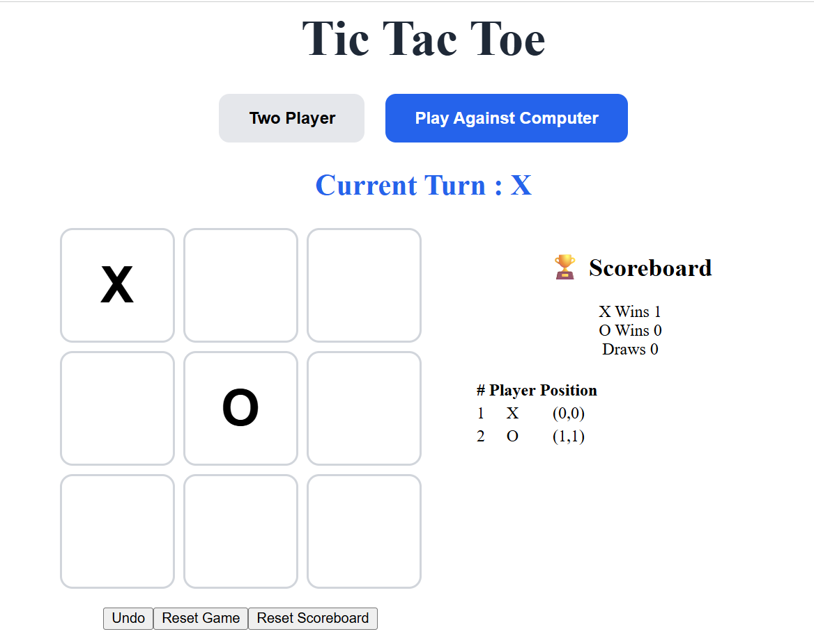

# Tic Tac Toe - Angular + .NET Full Stack Application

## Project Overview

This project is a browser-based Tic Tac Toe application developed using Angular and ASP.NET Core Web API. The application allows users to play Tic Tac Toe in either Two Player Mode or Play Against Computer Mode while maintaining game state, move history, undo functionality, and a session-level scoreboard.

The backend serves as the source of truth and manages all game rules, move validation, game state transitions, undo operations, and scoreboard updates.

---

# Tech Stack

## Frontend
- Angular
- TypeScript
- HTML5
- CSS3

## Backend
- ASP.NET Core Web API (.NET 8)
- C#

## Storage
- In-Memory Storage

## Testing
- xUnit

## Source Control
- GitHub

---

# Features Implemented

## Game Board
- Standard 3×3 Tic Tac Toe board
- Clickable empty cells
- Locked occupied cells
- Current player indicator

## Game Modes

### Two Player Mode
- Player X vs Player O
- Alternate turns

### Play Against Computer
- Human = X
- Computer = O
- Automatic computer move generation

## Win Detection
- Row wins
- Column wins
- Diagonal wins
- Winning cells highlighted
- Additional moves prevented after completion

## Draw Detection
- Detects full board with no winner
- Displays draw message
- Prevents additional moves

## Move History
Tracks:
- Move Number
- Player
- Row
- Column

Example:

| Move | Player | Position |
|--------|--------|----------|
| 1 | X | Row 1, Column 1 |
| 2 | O | Row 2, Column 2 |

## Undo Functionality

### Two Player Mode
Removes only the latest move.

Example:

X → O → Undo

Result:
- O move removed
- O plays again

### Computer Mode
Removes both:
- Computer's last move
- Human's previous move

Result:
- Board restored
- X plays again

## Scoreboard
Tracks:
- X Wins
- O Wins
- Draws

Features:
- Updates only once per completed game
- Reset Game does not affect scoreboard
- Reset Scoreboard available

---

# Computer AI Strategy

Computer move priority:

1. Play winning move
2. Block opponent winning move
3. Take center cell
4. Take available corner
5. Take first available cell

This approach provides predictable and efficient gameplay while satisfying assignment requirements.

---

# Architecture

## Frontend Responsibilities

- Render board UI
- Display game state
- Display move history
- Display scoreboard
- Display game status messages
- Invoke backend APIs
- Update UI using API responses

## Backend Responsibilities

- Game state management
- Move validation
- Turn switching
- Winner detection
- Draw detection
- Undo operations
- Computer move generation
- Scoreboard management

---

# Project Structure

```text
TicTacToeGame
│
├── backend
│   ├── TicTacToe.Api
│   ├── TicTacToe.Application
│   ├── TicTacToe.Base
│   ├── TicTacToe.Core
│   ├── TicTacToe.Tests
│   └── TicTacToeGame.sln
│
├── frontend
│   └── tic-tac-toe-frontend
│
└── README.md
```

---

# Running the Backend

## Prerequisites

- .NET 8 SDK

Verify installation:

```bash
dotnet --version
```

## Run Application

```bash
cd backend

dotnet restore

dotnet run
```

Backend URL:

```text
https://localhost:7170
```

Swagger:

```text
https://localhost:7170/swagger
```

---

# Running the Frontend

## Prerequisites

- Node.js LTS
- Angular CLI

Install Angular CLI:

```bash
npm install -g @angular/cli
```

Verify:

```bash
ng version
```

## Run Application

```bash
cd frontend

npm install

ng serve
```

Frontend URL:

```text
http://localhost:4200
```

---

# API Endpoint Summary

## Create New Game

```http
POST /api/games
```

Request:

```json
{
  "gameMode": "TwoPlayer"
}
```

Response:

```json
{
  "gameId": "guid"
}
```

---

## Get Current Game State

```http
GET /api/games/{id}
```

---

## Submit Move

```http
POST /api/games/{id}/moves
```

Request:

```json
{
  "player": "X",
  "row": 0,
  "column": 0
}
```

---

## Undo Move

```http
POST /api/games/{id}/undo
```

---

## Reset Game

```http
POST /api/games/{id}/reset
```

---

## Get Scoreboard

```http
GET /api/scoreboard
```

Response:

```json
{
  "xWins": 5,
  "oWins": 2,
  "draws": 3
}
```

---

## Reset Scoreboard

```http
POST /api/scoreboard/reset
```

---

# Game State Response Model

```json
{
  "gameId": "guid",
  "board": [
    ["X", "", ""],
    ["", "O", ""],
    ["", "", ""]
  ],
  "currentPlayer": "X",
  "gameMode": "TwoPlayer",
  "status": "InProgress",
  "winner": null,
  "winningCells": [],
  "moveHistory": []
}
```

## Game Status Values

```text
InProgress
Won
Draw
```

---
## Screenshots





# Testing

## Running Tests

```bash
dotnet test
```

## Unit Test Coverage

The solution includes tests for:

- Valid move
- Invalid move
- Turn switching
- Row win detection
- Column win detection
- Diagonal win detection
- Draw detection
- Reset game
- Undo in Two Player mode
- Undo in Computer mode
- Scoreboard update
- Computer move selection
- Move after game completion

---

# Design Decisions

## Backend as Source of Truth

All game state and rule validation reside in the backend.

Benefits:
- Consistent state
- Easier testing
- Clear separation of concerns

## In-Memory Storage

Selected because:

- Simpler setup
- No database dependency
- Suitable for coding exercise requirements

## Undo Strategy

Implemented Option A:

### Disable Undo After Game Completion

Reason:
- Prevents scoreboard inconsistencies
- Simpler implementation
- Matches expected user experience

## Computer AI

A lightweight rule-based AI was selected instead of Minimax because:

- Satisfies assignment requirements
- Easier to explain during review
- Faster implementation

---

# AI-Assisted Development Summary

AI tools were used to assist with:

- Requirement breakdown
- Service structure generation
- Angular component planning
- Unit test generation
- README preparation

All generated code was reviewed, modified, tested, and validated manually before inclusion.

---

# Assumptions

- Human player is always X.
- Computer player is always O.
- One active game session at a time.
- Backend restart clears in-memory data.
- Undo is disabled after game completion.
- Scoreboard is maintained during application runtime.

---

# Known Limitations

- No persistent storage.
- No authentication or authorization.
- No multiplayer support.
- No game replay functionality.
- No cloud deployment configuration.

---

# Future Improvements

- SQLite persistence
- SQL Server support
- SignalR real-time gameplay
- User authentication
- Online multiplayer
- Minimax AI implementation
- Docker support
- CI/CD pipeline
- Azure deployment
- Game replay and analytics

---

# Acceptance Criteria Checklist

- [x] Angular application runs locally
- [x] .NET API runs locally
- [x] REST API communication
- [x] New game creation
- [x] Two Player Mode
- [x] Computer Mode
- [x] Turn management
- [x] Move validation
- [x] Win detection
- [x] Draw detection
- [x] Winning cell highlighting
- [x] Move history
- [x] Undo functionality
- [x] Session scoreboard
- [x] Reset Game
- [x] Reset Scoreboard
- [x] Unit tests included
- [x] Setup documentation
- [x] API documentation

---

# Author

Developed as part of a Full Stack Angular + .NET Technical Assessment.
